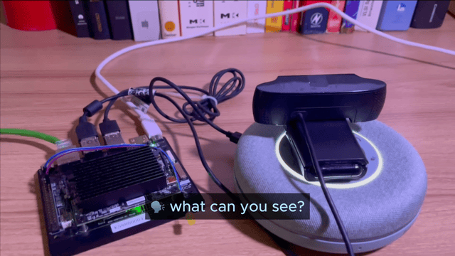

# On-Device AI Voice Assistant



This demonstration showcases an contextual AI voice assistant operating entirely on-device, with no cloud dependency or offloading, designed to run on [Synaptics Astra](https://www.synaptics.com/products/embedded-processors/astra-machina-foundation-series) Machina SL1680 linux development board. 

- Understanding context-specific queries.
- Responding quickly (as low as 500ms) and accurately without cloud dependence.
- Tool calling peripherals or cloud services for extended functionality.
- Leveraging multi-modal systems for vision-based queries.
- Hallucination-free responses, providing Q&A dataset is clean (see Limitations).

This project builds upon the work and contributions of many open source AI projects and individuals, including:

1. **Speech-to-Text**: [Moonshine](https://github.com/usefulsensors/moonshine) by Useful Sensors Inc., which is 5x faster than Whisper with better accuracy.
2. **Response Generation**: Context-specific Q&A matching using an encoder-only [language model](https://www.sbert.net/docs/quickstart.html) (future support for small LLM planned).
3. **Text-to-Speech**: [Piper](https://github.com/rhasspy/piper) by the Open Home Foundation.

Created by Dominic Pajak, Synaptics Inc. with thanks to Aditya Sahu, Andrew Duggan, Dharini Subramaniam, Karthik Shanmuga Vadivel, Lorenzo Keller, Manjunath Duntoor, Michael Pan, and Sauryadeep Pal.

---

## Installation Guide

### Prerequisites

- Synaptics Astra SL1680 board with Astra OOBE image v1.2 or above
- Internet connection for initial setup
- USB speakerphone device connected (check it is recognized by using `aplay -l`)

### Steps

1. Clone this repository onto the SL1680 board.
2. Start a terminal session and navigate to the project directory:
    ```bash
    cd on-device-assistant
    ```
3. Run the installation script:
    ```bash
    ./install.sh
    ```
4. Activate the Python virtual environment:
    ```bash
    source .venv/bin/activate
    ```
5. Test the setup:
    ```bash
    python3 main.py
    ```
6. Pre-generate WAV files for faster responses:
    ```bash
    python3 prebuild-wavs.py
    ```

---

---

## Example Queries

Below are some common questions and responses that demonstrate how this AI assistant handles queries:

### Basic Information
**Q** - Who are you? What is your name?  
**A** - I am an AI assistant running on Synaptics Astra SL1680.

**Q** - My dishwasher won't start.  
**A** - If your dishwasher isn't starting, check that it's plugged in, the circuit breaker hasn't tripped, the door is fully closed, and the Power button is activated.

---

## Tool Calling

Supported tools can be invoked using loose semantic queries. This enables dynamic interaction with:

- **Peripherals**: Control GPIO or other hardware components.
- **Cloud APIs**: Call external APIs for extended functionality.
- **Vision Models**: Leverage NPU-based vision systems for multi-modal queries.

Refer to [tools.json](https://github.com/dpajak-synaptics/on-device-assistant/blob/main/data/tools.json) for implementation details.

### Example Queries with Tool Calling

**Q** - What's the weather like?  
**A** - The weather in San Jose is partly cloudy, 58°F.

**Q** - What's the time?  
**A** - The time is 3:45 PM.

### Not included in this version

**Q** - Turn on the light.  
**A** - (GPIO peripheral activated to control the light.)

**Q** - What can I see?  
**A** - I can see a {call_vision} (Vision model invoked for object recognition.)


---

## On-device AI assitant architecture

It is deliberately designed to be **context specific**, using encoder-only language model and pre-generated question-answer pairs to achieve low latency on an embedded linux board (500-600ms when using the int8 quantization of Useful Sensors Moonshine base model). However, semantic matching enables sufficiently natural, private, and responsive interactions about a single topic (e.g. commands or support questions for a specific device) with potential use in home, retail, or industrial applications that benefit from an effective voice UI.


### (a) Pre-Generation Architecture

In this architecture, data preparation happens in advance to ensure quick and efficient on-device responses.

1. **Data Preparation**:
    - Manual data sources, such as user manuals or FAQs, can be pre-processed into text chunks using open-source tools like [IBM docling](https://github.com/DS4SD/docling).
    - These text chunks can then processed into structured Q&A datasets using a cloud-based large language model (LLM), with prompt engineering to generate natural user questions based on source materials.
2. **Semantic Search Index**:
    - A sentence transformer generates question embeddings, enabling semantic search for similar-meaning queries. The encoder-only sentence transformer ensures high performance and avoids hallucination beyond pre-generated data.
3. **Deployment**:
    - The generated embeddings and answer text are packaged and loaded onto the device.

### (b) On-Device Architecture

This architecture enables seamless interaction between the user and the assistant without any external dependencies. Notably, it leverages an encoder-only sentence transformer for reasoning and response generation, offering a novel approach that ensures high performance while eliminating the possibility of hallucination beyond pre-generated data.

1. **Voice Input Pipeline**:
    - User speech is processed via Voice Activity Detection (VAD) to identify active voice input.
2. **Semantic Search**:
    - Transcribed text undergoes semantic search to match the closest pre-generated Q&A pair using the embeddings using cosine similarity. 
3. **Response Delivery**:
    - Matched responses are converted to audio using text-to-speech (TTS) models.
4. **Tool Querying**:
    - Peripherals, such as GPIO or other hardware components, can be controlled, and APIs can be invoked based on semantic matches. This enables dynamic interactions and extends assistant capabilities.
5. **Multi-Model Systems**:
    - Tool calling can include vision models running on the NPU for object recognition or environmental understanding. For example, the query "What can I see?" could invoke a vision model, responding with: "I can see a {call_vision}" for enhanced multi-modal capabilities.

---

## On-Device Voice Pipeline

The following diagram represents the flow of data within the on-device voice assistant:

```
User Speech --> [VAD] --> [STT] --> [Embeddings] -----------> [Semantic search]
                                                                        |
                                                                        |
                                                                        v
                                                               [Look up Answer]
                                                                        |
                                                                        |
[Run tool e.g. GPIO, Cloud APIs]   <-----------yes---------[Contains Tool Call token?]
        |                                                               |
        |                                                               |
        |                                                               v
        --------Insert tool response into answer------------------>   [TTS]
                                
                         
```

- **Voice Activity Detection (VAD)**: Detects when a user begins speaking.
- **Speech-to-Text (STT)**: Transcribes user speech into text using Moonshine.
- **Embeddings**: Converts user question into an embedding
- **Semantic search**: Perform cosine similarity search against pre-generated question embeddings.
- **Text-to-Speech (TTS)**: Converts retrieved answers into natural-sounding audio output.
- **Tool Querying**: Allows interaction with peripherals, vision models, or external APIs for additional functionalities.

---

## Limitations

While the on-device voice assistant demo offers a lot of potential, there are some limitations to consider:

1. **Speech-to-Text (STT)**:
     - **Accuracy**: The accuracy of STT can be affected by background noise, accents, and speech clarity, potentially leading to misinterpretations.
     - **Latency**: High-quality STT models can be resource-intensive, requiring significant processing power and memory, which may impact performance on lower-end devices.

2. **Semantic Search**:
     - **Pre-generated Data Dependency**: The system relies on pre-generated Q&A pairs, limiting its ability to handle queries outside the scope of the pre-defined dataset (although it can be added to at runtime relatively easily)
     - **Contextual Understanding**: While semantic search can match similar-meaning queries, it may struggle with nuanced or highly contextual questions that require deeper understanding.
     - **Scalability**: As the dataset grows, maintaining and updating the semantic search index can become challenging, potentially affecting response times and accuracy.

These limitations highlight areas for potential improvement and optimization in future iterations of the on-device voice assistant. Intent detection is an active area of research, and the authors' experience in prototyping this suggests a combination of symbolic/knowledge graphs with semantic matching would be a field worth investigating further for this application.

---


## Future Directions

The potential for on-device AI is vast, with applications extending beyond home appliances to consumer, commercial, medical, and industrial devices. The integration of vision models and tool calling capabilities further enhances the functionality of these systems. As the technology evolves, we anticipate more sophisticated interactions and improved performance, driven by advancements in small language models and efficient AI frameworks. Customization of the sentence transformer may yield better accuracy at smaller model size, beyond this, an agentic approach using fine tuned models from Hugging Face SmolLM2 looks promising for a on-device generative AI version.

For developers and engineers, practical examples and detailed guides are available on [developer.synaptics.com](https://developer.synaptics.com), providing a foundation for building and innovating with on-device AI solutions.

